# Vulkan 3D Graphics Rendering Cookbook - 2nd Edition [](https://github.com/PacktPublishing/3D-Graphics-Rendering-Cookbook-Second-Edition/actions)

**A comprehensive guide to exploring rendering algorithms in modern Vulkan**

by <a href="https://github.com/corporateshark">Sergey Kosarevsky</a> & <a href="https://github.com/LLViktor">Viktor Latypov</a> & <a href="https://github.com/rudybear">Alexey Medvedev</a>

<a href="https://www.packtpub.com/en-us/product/vulkan-3d-graphics-rendering-cookbook-9781803236612">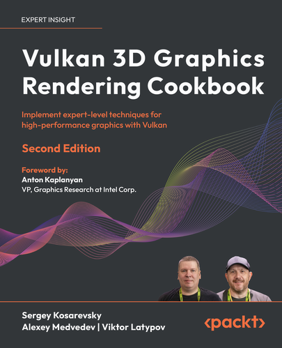</a>

This is the code repository for [Vulkan 3D Graphics Rendering Cookbook - 2nd Edition](https://www.packtpub.com/en-us/product/vulkan-3d-graphics-rendering-cookbook-9781803236612), published by Packt.

## What is this book about?
Vulkan is a low-overhead, cross-platform 3D graphics API that targets high-performance applications. 3D Graphics Rendering Cookbook helps you learn about modern graphics rendering algorithms and techniques using C++ programming with the Vulkan API.

This book covers the following exciting features:

* Improve the performance of legacy Vulkan applications with Vulkan 1.3
* Manage a substantial amount of content in real-time 3D rendering engines
* Discover how to debug and profile graphics applications
* Understand how to use the bindless approach in Vulkan
* Integrate various rendering techniques into a single application
* Find out how to develop Vulkan applications
* Implement a physically based glTF2 rendering pipeline from scratch
* Integrate a physics library with your rendering engine

If you feel this book is for you, get your [copy](https://www.amazon.com/Vulkan-Graphics-Rendering-Cookbook-High-Performance/dp/1803248114) today!

Software and Hardware List
--------------------------

| Chapter | Software required | OS required |
| -------- | ------------------------------------ | ----------------------------------- |
| 1-10 | Microsoft Visual Studio 2022 | Windows |
| 1-10 | GCC 13 | Linux |
| 1-10 | Python 3.x | Windows, Linux |
| 1-10 | Vulkan SDK | Windows, Linux |

The code runs on graphics cards which support Vulkan 1.3. GeForce RTX 2060 or newer is strongly recommended.

## Instructions and Navigations

All of the code is organized into folders. For example, Chapter01.

The code will look like the following:
```
macro(SETUP_GROUPS src_files)
foreach(FILE ${src_files})
get_filename_component(PARENT_DIR "${FILE}" PATH)
```

**Following is what you need for this book:**
This book is for 3D graphics developers who are familiar with the mathematical fundamentals of 3D rendering and want to gain expertise in writing fast rendering engines with advanced techniques using C++ libraries and APIs. A solid understanding of C++ and basic linear algebra, as well as experience in creating custom 3D applications without using premade rendering engines is required.

With the following software and hardware list you can run all code files present in the book (Chapter 1-10).


Downloading assets and dependencies:
------------------------------------

Ensure that you’ve installed Git LFS https://git-lfs.com. This tool is essential for handling large files in Git, so it's important to have it set up before you proceed.

Run the `deploy_deps.py` script from the root folder of this repository. Make sure you have ~15Gb of free space before you download the assets and build the source code.

Models downloaded from Morgan McGuire's [Computer Graphics Archive](https://casual-effects.com/data)

Windows build instructions:
---------------------------

```
cd .build 
cmake .. -G "Visual Studio 16 2022" -A x64
start RenderingCookbook2.sln
```

Linux build instructions:
-------------------------

```
cd .build 
cmake ..
cd ..
```

Running the demos:
------------------

**Run compiled demos from the root folder of this repository**

Here's the complete list of all the demo applications included in this book.

### Chapter 1: Establishing a Build Environment

* 01_CMake
* 02_GLFW
* 03_Taskflow
* 04_GLSLang
* 05_BC7Compression

### Chapter 2: Getting Started with Vulkan

* 01_Swapchain

  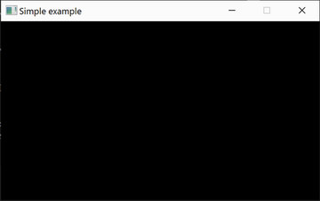

* 02_HelloTriangle

  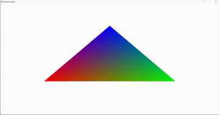

* 03_GLM

  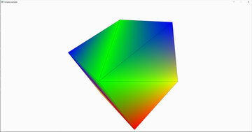

### Chapter 3: Working with Vulkan objects

* 01_Assimp

  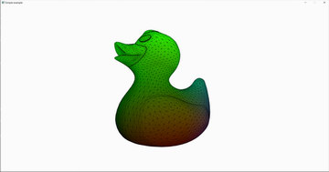

* 02_STB

  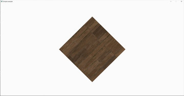

### Chapter 4: Adding User Interaction and Productivity Tools

* 01_ImGui

  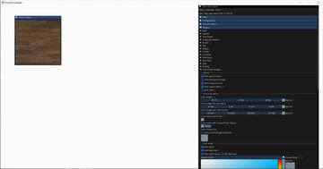

* 02_TracyProfiler

  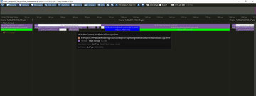

* 03_FPS

  

* 04_CubeMap

  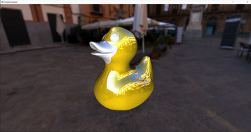

* 05_Camera

  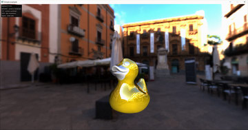

* 06_DemoApp

  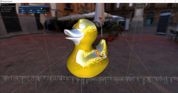


### Chapter 5: Working with Geometry Data

* 01_MeshOptimizer

  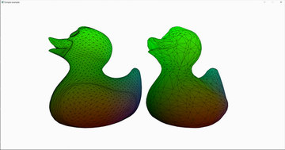

* 02_VertexPulling

  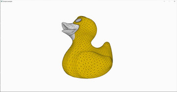

* 03_MillionCubes

  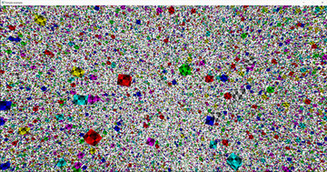

* 04_InstancedMeshes

  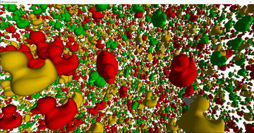

* 05_Grid

  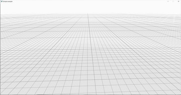

* 06_Tessellation

  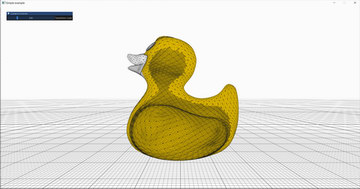

* 07_MeshRenderer

  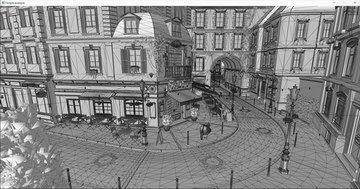

* 08_ComputeTexture

  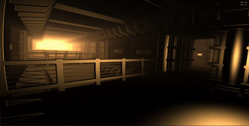

* 09_ComputeMesh

  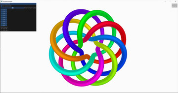

### Chapter 6: Physically Based Rendering Using the glTF 2.0 Shading Model

* 01_Unlit

  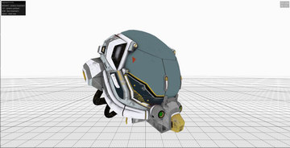

* 02_BRDF_LUT

  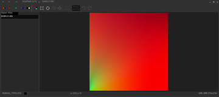

* 03_FilterEnvmap

  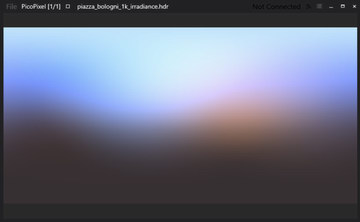

* 04_MetallicRoughness

  

* 05_SpecularGlossiness

  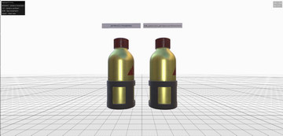

### Chapter 7: Advanced PBR extensions

* 01_Clearcoat

  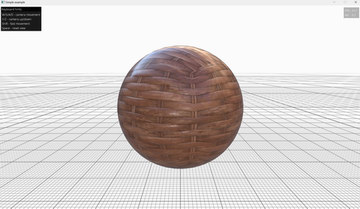

* 02_Sheen

  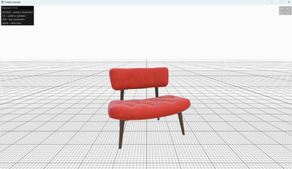

* 03_Transmission

  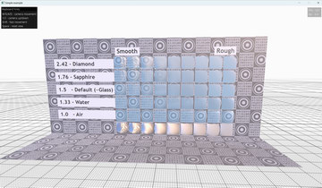

* 04_Volume

  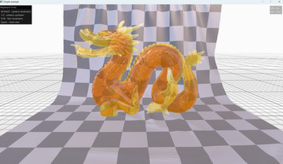

* 05_IOR

  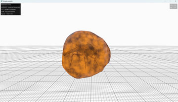

* 06_Specular

  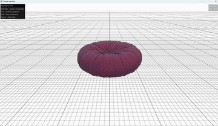

* 07_EmissiveStrength

  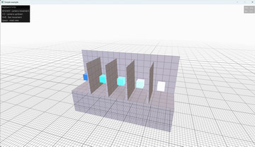

* 08_AnalyticalLight

  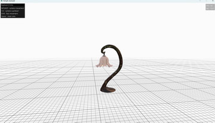

### Chapter 8: Graphics Rendering Pipeline

* 01_DescriptorIndexing

  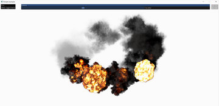

* 02_SceneGraph

  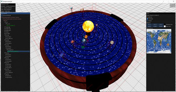

* 03_LargeScene

  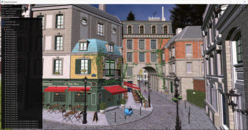

### Chapter 9: glTF Animations

* 01_AnimationPlayer

  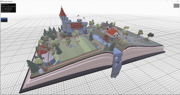

* 02_Skinning

  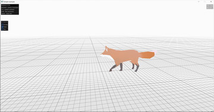

* 03_Morphing

  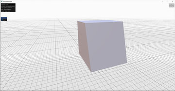

* 04_AnimationBlending

  

* 05_ImportLights

  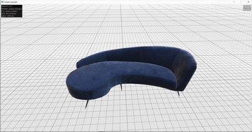

* 06_ImportCameras

  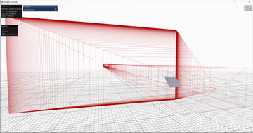

### Chapter 10: Image-based Techniques

* 01_OffscreenRendering

  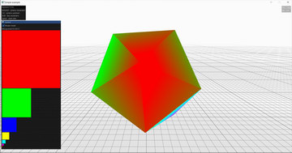

* 02_ShadowMapping

  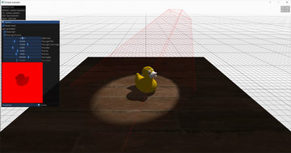

* 03_MSAA

  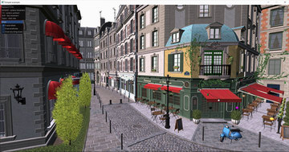

* 04_SSAO

  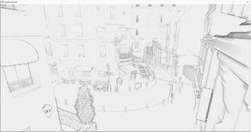

* 05_HDR

  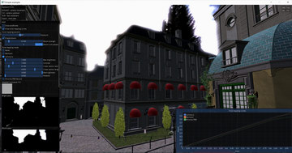

* 06_HDR_Adaptation

  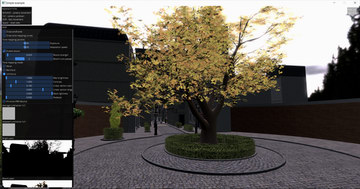

### Chapter 11: Advanced Rendering Techniques and Optimizations

* 01_CullingCPU

  

* 02_CullingGPU

  

* 03_DirectionalShadows

  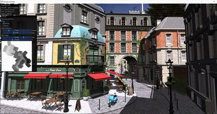

* 04_OIT

  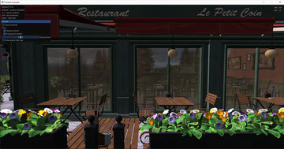

* 05_LazyLoading

  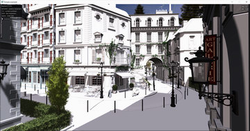

* 06_FinalDemo

  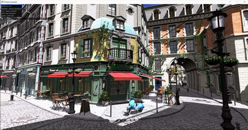


## Screenshots


## Get to Know the Authors

**Sergey Kosarevsky**

Sergey Kosarevsky is a former rendering lead at Ubisoft RedLynx. He currently leads Vulkan development at Meta.
He worked in the mobile industry at SPB Software, Yandex, Layar and Blippar, TWNKLS, and DAQRI,
where he designed and implemented real-time rendering technology.
He has more than 20 years of software development experience and more than 12 years of mobile
and embedded 3D graphics experience. In his Ph.D. thesis, Sergey employed computer vision to
solve mechanical engineering problems. He has co-authored several books on mobile software development in C++.

**Viktor Latypov**

Viktor Latypov is a software engineer specializing in embedded C/C++, 3D graphics, and computer vision. With more than 15 years of software development experience and a Ph.D. in Applied Mathematics, he has implemented a number of real-time renderers for medical and automotive applications over the last 10 years.
Together with Sergey, he has co-authored two books on mobile software development in C++

**Alexey Medvedev**

Alexey Medvedev is a technical expert with a rich background in game development. He currently serves as the AR Technical Lead at Meta, where he brings his passion for cutting-edge technology to drive innovation. Prior to joining Meta, Alexey honed his skills at prominent companies such as Crytek, Blizzard, and 2K, making significant contributions to the gaming industry.


## Other books by the authors

[Android NDK Game Development Cookbook](https://www.packtpub.com/product/android-ndk-game-development-cookbook/9781782167785?utm_source=github&utm_medium=repository&utm_campaign=9781782167785)

[Mastering Android NDK](https://www.amazon.com/Mastering-Android-NDK-Sergey-Kosarevsky-ebook/dp/B0151N0GAO)

[3D Graphics Rendering Cookbook](https://www.amazon.com/Graphics-Rendering-Cookbook-comprehensive-algorithms/dp/1838986197)
